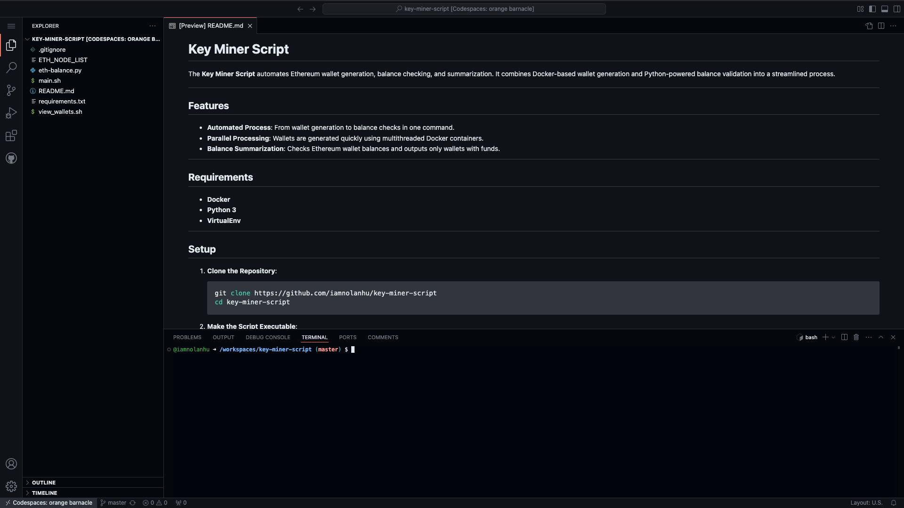
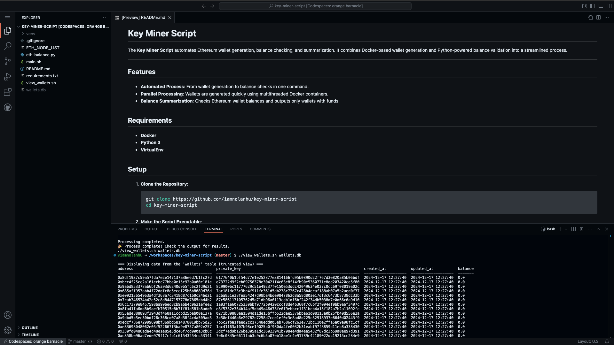

# **Key Miner Script**

<!-- Author: Nolan Hu | https://nolanhu.com -->

The **Key Miner Script** automates Ethereum wallet generation, balance checking, and summarization. It combines Docker-based wallet generation and Python-powered balance validation into a streamlined process.

---

## **Features**

- **Automated Process**: From wallet generation to balance checks in one command.  
- **Parallel Processing**: Wallets are generated quickly using multithreaded Docker containers.  
- **Balance Summarization**: Checks Ethereum wallet balances and outputs only wallets with funds.  

---

## **Requirements**

- **Docker**  
- **Python 3**  
- **VirtualEnv**  

---

## **Setup**

1. **Clone the Repository**:
   ```bash
   git clone https://github.com/iamnolanhu/key-miner-script
   cd key-miner-script
   ```

2. **Make the Script Executable**:
   ```bash
   chmod +x main.sh
   ```

---

## **Usage**

To automate the entire process, simply run:

```bash
./main.sh
```

---

## **How It Works**

1. **Environment Setup**:
   - Creates and activates a Python virtual environment.
   - Installs required dependencies from `requirements.txt`.

2. **Wallet Generation**:
   - Uses Docker to generate wallets and save them to a database (`wallets.db`).

3. **Monitor Progress**:
   - Waits until the Docker container finishes wallet generation.

4. **Balance Check**:
   - Runs `eth-balance.py` to query Ethereum wallet balances and updates the database.

5. **Summarize Results**:
   - Outputs the wallets with **non-zero balances**.

---

## **Screenshots and Demo**

### **Running the Script**


### **After Running the Script**


### **Demo GIF**


---

## **Output Example**

When the process completes, you’ll see output like this:

```
🚀 Starting the Key Miner Script...
🔧 Creating virtual environment...
🔷 Activating virtual environment...
📦 Installing dependencies...
⛏️ Generating wallets using Docker...
💭 Wallet generation in progress... checking again in 5 seconds.
✅ Wallet generation completed.
💰 Checking wallet balances...

Wallets with balance:
0x420d2455e5533fb715ae13b0c22a1074bbfe9420: 0.5 ETH
0x420dc893957607608b5b091a220859c39ee64420: 0.25 ETH
🎉 Process complete! Check the output for results.
```

---

## **Files**

- **`main.sh`**: The master script to automate everything.
- **`eth-balance.py`**: Python script to check wallet balances.
- **`requirements.txt`**: Python dependencies list.
- **`ETH_NODE_LIST`**: Ethereum node list.

---

## **Dependencies**

Make sure you have:
- Docker installed and running.
- Python 3 with VirtualEnv installed.

Install dependencies manually if needed:
```bash
source venv/bin/activate
pip install -r requirements.txt
```

---

## **Advanced Options**

To customize wallet generation parameters, edit the `main.sh` script:

- **Wallet Count**: `-limit 1000` (number of wallets to generate)
- **Threads**: `-c 8` (number of threads for Docker)
- **Mode**: `-mode 2` (wallet generation mode)

---

## **Troubleshooting**

- **Docker Not Running**: Ensure Docker is installed and the daemon is running.
- **Script Permission**: If you get a permission error, run:
   ```bash
   chmod +x main.sh
   ```
- **Python Issues**: Verify Python 3 is installed with:
   ```bash
   python3 --version
   ```

---

## **License**

This project is licensed under the **MIT License**.

---
